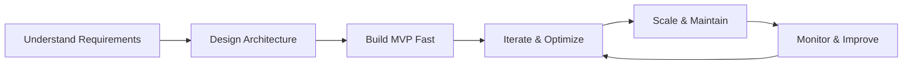

<div align="center">

# 👋 Hi, I'm Ahmad Hassan


<p align="center">
  
  
  
  
  
  
</p>

<p align="center">
  <a href="https://ahmad-hassan-mern.vercel.app"></a>
  <a href="https://www.linkedin.com/in/ahmad-hassan-mern"></a>
  <a href="mailto:hassanqaisar129096@gmail.com"></a>
</p>

📍 **Lahore, Pakistan** | 💼 **3+ Years Experience** | 🚀 **10x Product Builder**

</div>

---

## 🎯 About Me

```typescript
const ahmad = {
  role: "Full-Stack Software Engineer",
  experience: "3+ years",
  specialization: [
    "Production-grade SaaS platforms",
    "E-commerce marketplaces", 
    "POS & inventory systems",
    "High-performance web applications"
  ],
  philosophy: "Ship fast, scale smart, build maintainable",
  impact: {
    monthlyTransactions: "50,000+",
    uptime: "99.9%",
    focus: "Real-world products, not just code"
  }
};
```

<details>
<summary>🔥 <b>What Makes Me Different</b></summary>
<br>

- **🏗️ Architecture-First:** I design systems that scale from day one
- **⚡ Performance Obsessed:** 20% faster load times, 25% better engagement
- **🎯 Product-Minded:** I think beyond code—I build solutions that drive business value
- **🤝 Team Player:** Reduced code review time by 30% through better standards
- **📈 Results-Driven:** Every line of code maps to measurable outcomes

</details>

---

## 🛠️ Tech Stack

<table>
<tr>
<td width="50%" valign="top">

### 🎨 Frontend
```javascript
const frontend = {
  frameworks: ['React.js', 'Next.js'],
  languages: ['TypeScript', 'JavaScript'],
  stateManagement: ['Redux Toolkit'],
  forms: ['React Hook Form'],
  styling: ['Tailwind CSS', 'Material-UI'],
  tools: ['Webpack', 'Vite']
};
```

</td>
<td width="50%" valign="top">

### ⚙️ Backend
```javascript
const backend = {
  runtime: ['Node.js'],
  frameworks: ['Express.js'],
  databases: ['PostgreSQL', 'MongoDB'],
  orm: ['Prisma', 'Mongoose'],
  architecture: ['REST APIs', 'Microservices'],
  optimization: ['Caching', 'Query Optimization']
};
```

</td>
</tr>
</table>

<div align="center">

### 🔧 Tools & DevOps


</div>

---

## 💼 Professional Experience


### 🚀 **Software Engineer** — ByteForge
**Dec 2025 – Present** | Lahore, Pakistan

- 🏗️ Building scalable internal systems with **React, Next.js, Node.js & PostgreSQL**
- 🎯 Contributing to **architecture design** and performance optimization
- 📊 Improving engineering standards and code quality across teams
- ⚡ Driving feature delivery with focus on **maintainability** and **scalability**

<br clear="right"/>

---

### 💎 **Software Engineer** — SeeBiz Pvt Ltd
**May 2022 – Nov 2025** | Lahore, Pakistan

<div align="center">

| 🎯 Achievement | 📈 Impact |
|:---|:---|
| Built full-featured **e-commerce marketplace** | **50K+ monthly transactions** |
| Optimized performance with memoization | **20% faster page loads** |
| Enhanced UX with modern patterns | **25% longer sessions, 15% more conversions** |
| Implemented modular architecture | **30% faster code reviews** |
| Maintained production systems | **99.9% uptime** |

</div>

**Key Highlights:**
- 🎨 Architected **scalable frontend** with React, Redux Toolkit, and TypeScript
- ⚡ Implemented **code splitting** and lazy loading for optimal performance
- 🔧 Established **linting standards** and best practices
- 📦 Built **reusable component library** used across multiple projects

---

### 🔨 **Associate Software Engineer** — SeeBiz
**May 2022 – Jun 2023**

- 📊 Developed **reusable dashboards** with React Hook Form & Chart.js
- 🔗 Integrated **backend APIs** with optimized query handling
- 🧪 Practiced **Agile methodologies** with comprehensive testing

---

### 🌱 **Software Engineer Intern** — BizzClan
**Feb 2021 – Apr 2022**

- 🎯 Built **responsive dashboards** with React.js & Chart.js
- ⚡ Improved frontend performance by **20%** through optimization
- 🔧 Assisted in **REST API development** and system integrations

---

## 📊 GitHub Stats

<div align="center">
  
  
</div>

<div align="center">
  
</div>

---

## 🎓 Education & Certifications

<table>
<tr>
<td width="60%">

### 🎓 Education
**BS Computer Science**  
COMSATS Institute of Information and Technology  
📅 2017 – 2021

</td>
<td width="40%">

### 🏆 Certifications
- ✅ MongoDB Document Model
- ✅ React Developer Certification

</td>
</tr>
</table>

---

## 🎯 What I Can Help You Build

<div align="center">

| 💼 SaaS Platforms | 🛒 Marketplaces | 📊 POS Systems | 🎨 Dashboards |
|:---:|:---:|:---:|:---:|
| Scalable architecture | Payment integration | Inventory management | Real-time analytics |
| Multi-tenant systems | Search & filters | Order processing | Custom reports |
| Authentication & roles | Vendor management | Receipt generation | Data visualization |

</div>

---

## 📈 My Approach



---

## 🤝 Let's Connect & Build

<div align="center">

### 💡 **I help teams ship faster, scale better, and avoid costly mistakes**

<p>
  <a href="https://ahmad-hassan-mern.vercel.app">
    
  </a>
  <a href="https://www.linkedin.com/in/ahmad-hassan-mern">
    
  </a>
  <a href="mailto:hassanqaisar129096@gmail.com">
    
  </a>
</p>

---

### ⭐ **If you find my work valuable, consider starring some repositories!**


</div>
