<div align="center">


<p align="center">
  
</p>

<p align="center">
  
  
  
  
</p>

[](https://ahmad-hassan-mern.vercel.app)
[](https://www.linkedin.com/in/ahmad-hassan-mern)
[](mailto:hassanqaisar129096@gmail.com)

</div>

---


##  About Me

```javascript
class SoftwareEngineer {
  constructor() {
    this.name = "Ahmad Hassan";
    this.role = "Full-Stack Engineer";
    this.location = "Lahore, Pakistan 🇵🇰";
    this.experience = "3+ years";
  }
  
  getCurrentWork() {
    return {
      company: "ByteForge",
      position: "Software Engineer",
      tech: ["React", "Next.js", "Node.js", "PostgreSQL"],
      focus: "Building scalable internal systems"
    };
  }
  
  getSkills() {
    return {
      frontend: ["React", "Next.js", "TypeScript", "Redux"],
      backend: ["Node.js", "Express", "PostgreSQL", "MongoDB"],
      architecture: ["Microservices", "REST APIs", "System Design"],
      specialties: ["Performance Optimization", "Scalable SaaS"]
    };
  }
  
  getStats() {
    return {
      monthlyTransactions: "50,000+",
      systemUptime: "99.9%",
      performanceGains: "20% faster load times",
      userEngagement: "25% increase"
    };
  }
}

const ahmad = new SoftwareEngineer();
```

<br clear="right"/>

### 🎯 What I Do Best

<table>
<tr>
  <td align="center" width="25%">
    
    <br><b>Scalable Architecture</b>
    <br><sub>Building systems that grow</sub>
  </td>
  <td align="center" width="25%">
    
    <br><b>Performance Tuning</b>
    <br><sub>20% faster applications</sub>
  </td>
  <td align="center" width="25%">
    
    <br><b>Clean Code</b>
    <br><sub>Maintainable & testable</sub>
  </td>
  <td align="center" width="25%">
    
    <br><b>Product Delivery</b>
    <br><sub>Ship fast, scale smart</sub>
  </td>
</tr>
</table>

---

##  Tech Stack

<div align="center">

### 💻 Languages & Frameworks


### 🎨 Frontend Technologies


### 🗄️ Databases & ORMs


### 🛠️ Tools & DevOps


</div>

---

##  Professional Journey

<details open>
<summary><b>🚀 Software Engineer @ ByteForge (Dec 2025 – Present)</b></summary>
<br>

```typescript
const currentRole = {
  company: "ByteForge",
  position: "Software Engineer",
  location: "Lahore, Pakistan",
  responsibilities: [
    "🏗️ Building scalable internal systems with React, Next.js & PostgreSQL",
    "🎯 Contributing to architecture design and performance optimization",
    "📊 Improving code quality & engineering standards across teams",
    "⚡ Driving feature delivery with focus on maintainability"
  ],
  impact: "Setting new standards for system reliability and performance"
};
```

</details>

<details>
<summary><b>💎 Software Engineer @ SeeBiz Pvt Ltd (May 2022 – Nov 2025)</b></summary>
<br>

<div align="center">

### 📊 Key Achievements

| Metric | Result | Impact |
|--------|--------|--------|
| 🛒 **E-commerce Platform** | Full-featured marketplace | 50,000+ monthly transactions |
| ⚡ **Performance** | Memoization & code splitting | 20% faster page loads |
| 👥 **User Engagement** | Enhanced UX patterns | 25% longer sessions |
| 💰 **Conversions** | Improved user flows | 15% increase |
| ⏱️ **Code Reviews** | Modular architecture | 30% faster reviews |
| 🎯 **Uptime** | Production reliability | 99.9% availability |

</div>

**Technical Highlights:**
- Built scalable frontend with React, Redux Toolkit & TypeScript
- Implemented code splitting and lazy loading for optimal performance
- Established linting standards and best practices
- Created reusable component library used across multiple projects
- Integrated payment gateways and real-time notifications

</details>

<details>
<summary><b>🔨 Associate Software Engineer @ SeeBiz (May 2022 – Jun 2023)</b></summary>
<br>

- 📊 Developed reusable dashboards with React Hook Form & Chart.js
- 🔗 Integrated backend APIs with optimized query handling
- 🧪 Practiced Agile methodologies with comprehensive testing
- 🎨 Built responsive UI components for internal tools

</details>

<details>
<summary><b>🌱 Software Engineer Intern @ BizzClan (Feb 2021 – Apr 2022)</b></summary>
<br>

- 🎯 Built responsive dashboards with React.js & Chart.js
- ⚡ Improved frontend performance by 20% through optimization
- 🔧 Assisted in REST API development and system integrations
- 📚 Learned production-grade development practices

</details>

---

## 📊 GitHub Statistics

<div align="center">

<!-- Option 1: Using main vercel instance -->


</div>

<div align="center">

<!-- Streak Stats -->


</div>

<!-- 
If the above images don't load, try these alternative deployments:

**Alternative 1 (Different deployment):**


**Alternative 2 (Sigma Five deployment):**


**Alternative 3 (Simple version):**


If none work, the service might be temporarily down. Wait a few minutes and refresh.
-->

---

## 🎓 Education & Certifications

<table>
<tr>
<td width="50%" valign="top">

### 🎓 Education


**COMSATS Institute of Information Technology**  
📅 2017 – 2021  
🎯 Focus: Software Engineering, Data Structures, Algorithms

</td>
<td width="50%" valign="top">

### 🏆 Certifications


- ✅ From Relational Model (SQL) to MongoDB's Document Model
- ✅ React Developer Certification

</td>
</tr>
</table>

---

## 💼 What I Can Build For You

<div align="center">

<table>
<tr>
<td align="center" width="33%">


### 🚀 SaaS Platforms
- Multi-tenant architecture
- Role-based access control
- Payment integration
- Analytics dashboards
- Automated workflows

</td>
<td align="center" width="33%">


### 🛒 Marketplaces
- Vendor management
- Product catalogs
- Search & filtering
- Order processing
- Review systems

</td>
<td align="center" width="33%">


### 📊 Business Tools
- POS systems
- Inventory management
- Real-time analytics
- Custom reports
- API integrations

</td>
</tr>
</table>

</div>

---

## 🎯 My Development Philosophy

```mermaid
graph LR
    A[🎯 Understand] --> B[🏗️ Design]
    B --> C[⚡ Build MVP]
    C --> D[🧪 Test]
    D --> E[🚀 Deploy]
    E --> F[📊 Monitor]
    F --> G[🔄 Optimize]
    G --> F
    
    style A fill:#58A6FF
    style B fill:#238636
    style C fill:#F85149
    style D fill:#A371F7
    style E fill:#D29922
    style F fill:#58A6FF
    style G fill:#238636
```

<div align="center">



</div>

---

## 🤝 Let's Build Something Amazing Together

<div align="center">

### 💡 I Help Teams Ship Faster & Scale Smarter

 <em><b>Open to exciting opportunities</b> and collaboration!</em>

<br><br>

<a href="https://ahmad-hassan-mern.vercel.app">
  
</a>
<a href="https://www.linkedin.com/in/ahmad-hassan-mern">
  
</a>
<a href="mailto:hassanqaisar129096@gmail.com">
  
</a>

<br><br>

### 🌟 If you find my work valuable, star my repositories!


</div>

---


<div align="center">

**⭐ Show some love by starring repositories you find interesting!**

**Made with ❤️ by Ahmad Hassan**

</div>
